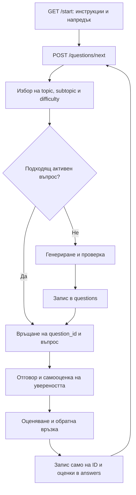

# Предложение за учебния поток

Статус: предложение за следваща реализация. Този commit добавя каталог с подтеми и инструмент за импорт. Описаните по-долу нови endpoints и адаптивни правила още не са реализирани.

## Препоръчана последователност

`GET /start` запазва сегашната си роля: връща контекст. След получаването му клиентът или учебният асистент извиква `POST /questions/next`. Това е естественото място за операция, която може да създаде въпрос и да използва платено генериране. GET заявката остава безопасна за повторение и презареждане според [HTTP semantics](https://www.rfc-editor.org/rfc/rfc9110.html#section-9.2.1).

Ако е нужен един бутон „Start“, клиентът може да изпълни двете заявки последователно. Ако по-късно се въведе общ `POST /sessions/start`, той трябва да използва същия вътрешен `QuestionSelectionService`. FastAPI endpoint не е необходимо да прави HTTP заявка към друг endpoint в същото приложение.

## 1. Изборът се прави от приложението

За първата версия:

1. Вземи активните topics, които имат поне една активна subtopic.
2. Избери равномерно случаен topic.
3. Избери равномерно случайна активна subtopic от този topic.
4. Определи difficulty в диапазона 1–5. При липса на данни предложена начална стойност е 2.

Така тема с повече въпроси няма да получава по-голям шанс само заради размера на банката. Редът на CSV не е учебен ред. Няма фиксиран план за редуване на технологии. Моделът получава вече избраните topic/subtopic/difficulty и формулира въпрос в тези граници.

За повторенията първо избягвай същия question_id сред последните отговорени въпроси. Случайният избор все пак може да върне същата подтема с различен аспект. Ако всички кандидати са наскоро използвани, генерирай нов или избери най-отдавна решавания при изрично правило за повторение. При празен активен каталог върни ясен резултат „няма налични теми“, вместо безкраен цикъл за търсене.

## 2. Избор или генериране на въпрос

`QuestionSelectionService` търси активен въпрос за избраните IDs и difficulty. Ако няма подходящ, `QuestionGenerator` получава:

- имената и IDs на topic/subtopic, избраната difficulty и езика;
- активните инструкции за поведение и компактно релевантно знание;
- последните въпроси по тази подтема за избягване на повторения;
- техническа версия/среда, когато въпросът зависи от нея.

Не е нужно целият архив от инструкции тип history или старите plan/handoff текстове да се подават при всеки въпрос. Правилото за случайния избор трябва да е водещо и стар план не бива да го отменя.

Генераторът връща структуриран резултат. Сървърът задава IDs и difficulty от собствения си избор, проверява непразен текст, съответствие с подтемата и липса на дубликат. Сегашният уникален индекс улавя само еднакъв текст без разлика в главни/малки букви; перифразите изискват допълнителна проверка. Проверката на структурата сама по себе си не доказва техническа вярност. За първоначалната банка е подходящ преглед на въпросите, а за генериране в движение — отделна проверка по критерии и наблюдение на грешките.

При успешна проверка въпросът се записва в `questions` преди показването му и се връща реалният `question_id`. При невалиден резултат са допустими ограничен брой повторни опити. При timeout или неуспех използвай проверен резервен въпрос от същата тема/подтема; ако няма такъв, върни възстановима грешка. Не записвай частичен или непроверен резултат като активен въпрос. Не дръж PostgreSQL транзакция отворена по време на заявката към модела; при записа провери отново дали topic/subtopic са активни.

Към проверката на 28.09.2026 базата съдържа 87 въпроса, от които 0 активни. Следователно първият учебен поток се нуждае от генератор или от подготвена активна банка. Самото добавяне на subtopics не добавя въпроси и не активира историческите.

## 3. Отговор, оценяване и запис

Потребителят отговаря и посочва увереността си от 1 до 5. Оценителят връща кратко обяснение на показаното самостоятелно, изясненото с помощ и останалото непроверено, плюс числовите оценки.

| Поле в answers | Предназначение |
| --- | --- |
| score | Коректност/общ резултат, 0–5 |
| independence_score | Самостоятелност според реално дадената помощ, 1–5 |
| clarity_score | Яснота на обяснението, 1–5 |
| completeness_score | Пълнота спрямо въпроса, 1–5 |
| confidence_score | Самооценка на увереността от потребителя, 1–5 |
| difficulty | Трудността на зададения въпрос, 1–5 |

Увереността не следва автоматично от правилността или стила на изразяване. При липсваща самооценка асистентът трябва да я поиска преди запис, защото колоната е задължителна. Самостоятелността се преценява по действително използвани подсказки и уточнения.

Текстът на отговора се използва временно при оценяване. В `answers` се записват само текущите колони: user/topic/subtopic/question IDs, оценки и timestamps. Отговорът и обратната връзка не се съхраняват в таблица или application request logs. Ако оценяването се изнесе към външен модел, политиката за съхранение на доставчика се конфигурира отделно.

Първата интеграция може да използва учебния асистент за оценяване и съществуващия `POST /answers` за запис. При изнасяне на оценяването в API може да има `POST /answers/evaluate`, който временно приема текста и записва оценките. Това е бъдещ договор; текущият `POST /answers` приема вече изчислени оценки. Връзките и difficulty се вземат от зададения въпрос, а не от свободно зададени от клиента стойности. Потребителят се разрешава от доверения контекст: засега конфигурираният LEARNIKAL_USERNAME, а при многопотребителски режим — автентикиран потребител.

## 4. Адаптиране след натрупване на данни

В текущата база няма колона `competence_score`. Първоначално това може да е изчислявана характеристика от `answers`, придружена от брой наблюдения и последна дата. Нужно е да се отчитат difficulty и independence_score; средно score върху лесни въпроси не доказва готовност за трудни.

Предложени правила за пилотна версия, които трябва да се настроят след реални сесии:

- Първо използвай историята за конкретния user/subtopic. При малко данни използвай по-консервативна начална оценка от topic и отбелязвай, че данните са недостатъчни.
- Няколко последователни добри и самостоятелни отговора на текущата трудност позволяват увеличение с едно ниво. Един отговор не е достатъчен за скок от 2 на 5.
- Нисък score и много помощ насочват към по-основен въпрос при следващо избиране на областта.
- Добър score и ниска confidence могат да доведат до един допълнителен въпрос за потвърждение с друга формулировка. Ниската увереност сама по себе си не намалява competence.
- Висока confidence и нисък score насочват към диагностичен въпрос за конкретното неразбиране.
- По-късно част от случайния избор може да получава по-висока тежест за непроверени, несигурни или отдавна упражнявани области. Всяка активна тема трябва да запази ненулев шанс за избор.

Първо бих реализирал равномерния избор и адаптиране само на difficulty. Теглата за избор на тема и допълнителните въпроси могат да дойдат след наблюдение на реалното поведение. Историческите оценки, възстановени от markdown, са приблизителни и не трябва сами да отключват най-висока трудност.

## 5. Повторни заявки и практически обхват

За надеждно продължаване след презареждане е полезен отделен запис за опит: attempt_id, user_id, question_id, статус, answer_id и timestamps. Той не съдържа текст на отговора и не възстановява старите learning_state/next_question механизми. Това е предложена бъдеща таблица, за която ще е нужна отделна миграция. Questions е общ каталог; висящият въпрос принадлежи на конкретен потребител/опит.

`POST /questions/next` трябва да приема ключ за идемпотентност и при повторение да връща същия опит. Кратка атомарна резервация преди генерирането предотвратява двойно плащане при паралелни заявки. Опитът се завършва атомарно при запис на оценките, така че повторна заявка да не създава втори answer. Сегашният `POST /answers` вече позволява повторение с еднакъв id и съдържание; сам по себе си това не управлява висящи опити.

За сегашния мащаб е достатъчен FastAPI, PostgreSQL и вътрешни компоненти за избор, генериране и оценяване на същия EC2. Отделна услуга, Kafka или Redis не са необходими за първата версия. Ако генерирането стане бавно или натоварено, може да се добави работник, който предварително подготвя проверени въпроси за избрани подтеми.

Преди включване на потока тестовете трябва да покриват избор само на активни записи, правилната принадлежност на subtopic, приблизително равномерно разпределение с фиксирано семе, липсваща история, граници на difficulty, празна банка, невалиден отговор от генератора, конкуриращи се повторни заявки и липса на текстове на отговорите в записите/логовете.
